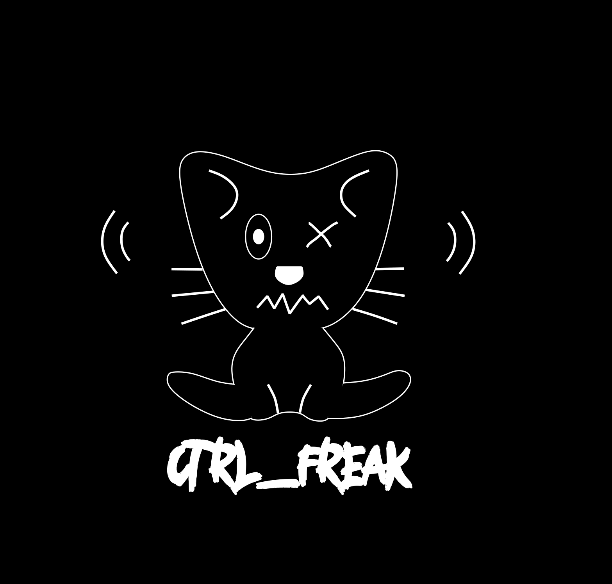

  

 

This project is a fork of [Cifertech's nRFBox project](https://github.com/cifertech/nRFBox).

My motivation on making this project relies on my curiosity to learn more about RF, WiFi, Bluetooth, BLE etc, also, my country banned the well known Flipper Zero, so it's impossible to get it here legally. I found this project of Cifer on Youtube days ago, from a shorts video he posted and I knew I should give it a try. I always wanted to create some project focused on Hacking, Pentest, but never actually had any idea on what to do. Now I'll be trying to create an entirely new project based on Cifer's nRFBox.

For this project I will keep the core features of the original project, but I wish to change the entire layout of the UI, add new functionalities and much more!

> This README file shares some informations with the original project README.

<h2>Functionality Status and Reliability</h2>
<table>
  <thead>
    <tr>
      <th>Feature</th>
      <th>Status</th>
      <th>Reliability</th>
      <th>Notes</th>
    </tr>
  </thead>
  <tbody>
    <tr>
      <td><strong>Evil portal</strong></td>
      <td>Development</td>
      <td>High</td>
      <td>Create an evil captive portal to get user credentials.</td>
    </tr>
    <tr>
      <td><strong>Scanner</strong></td>
      <td>Stable</td>
      <td>High</td>
      <td>Reliably scans the 2.4 GHz band to detect active channels and nearby devices. Occasional misses in high-interference environments.</td>
    </tr>
    <tr>
      <td><strong>Analyzer</strong></td>
      <td>Stable</td>
      <td>High</td>
      <td>Provides useful insights into detected signals, but additional updates are needed for improved accuracy and detailed analysis.</td>
    </tr>
    <tr>
      <td><strong>Jammer</strong></td>
      <td>Stable</td>
      <td>High</td>
      <td>Basic jamming works but effectiveness varies by device type and signal strength. Testing on select channels is recommended.</td>
    </tr>
    <tr>
      <td><strong>BLE Jammer</strong></td>
      <td>Stable</td>
      <td>High</td>
      <td>Disrupts BLE devices inconsistently. Further improvements are needed to ensure stability and effectiveness across BLE variants.</td>
    </tr>
    <tr>
      <td><strong>BLE Spoofer</strong></td>
      <td>Stable</td>
      <td>Low</td>
      <td>Capable of simulating basic BLE signals but has limited compatibility. Best for controlled testing scenarios.</td>
    </tr>
    <tr>
      <td><strong>Sour Apple</strong></td>
      <td>Stable</td>
      <td>Low</td>
      <td>Specialized attack method with limited reliability; effective only under specific conditions. Further tuning is required.</td>
    </tr>
  </tbody>
</table>

> [!NOTE]
> - When using **multiple NRF24** modules, the power demands can exceed the capabilities of the onboard power supply or regulator. Running three NRF modules simultaneously may cause instability, leading to intermittent failures or causing the nRFBox to stop functioning altogether.
> - **Range Limitations**: The jammer is most effective at short range. Beyond a certain distance, the signal weakens, making it harder to consistently disrupt communication.
> - **Device Variability**: Different devices react to jamming signals in varying ways. Some may be more resistant.

<!-- About the Project -->
## About the Project
CTRL_FREAK is a wireless toolkit designed to explore, analyze, and interact with various wireless communication protocols. It combines the ESP32 Wroom32U, NRF24 modules, an OLED display, and other components to create a multifunctional device that can act as a scanner, analyzer, jammer, BLE jammer, BLE spoofer, and perform advanced tasks such as the "Sour Apple" attack.

<!-- Features -->
### 🎯 Features
- **Evil portal** - Creates an rogue AP that redirects to a fake captive portal to extract user credentials.
- **Scanner** - Scans the 2.4GHz frequency band to detect active channels and devices.
- **Analyzer** - Analyzes the detected signals and provides detailed information about the activity.
- **Jammer** - Jams wireless communication on selected channels to test network robustness.
- **BLE Jammer** - Specifically targets Bluetooth Low Energy (BLE) devices to disrupt their communication.
- **BLE Spoofer** - Spoofs BLE devices to simulate various BLE signals for testing and research.
- **Sour Apple** - A specialized attack for testing security measures against specific wireless vulnerabilities.
- **Proto Kill Mode** - Proto Kill has evolved into a powerful tool for disrupting various protocols.
- **WiFi Scanner** - Scan for hidden and visible BLE devices
- **BLE Scanner** - List nearby Wi-Fi networks with extended details
- **Wi-Fi Deauthentication Attack** - Send deauthentication frames to disrupt client connections

### Future features
- **Signal repeater** - Repeats any 2.4GHz signals captured.
- **Online firmware updater** - Updates the firmware online, downloading it directly from the Internet.

<!-- License -->
## License

Distributed under the MIT License. See LICENSE.txt for more information.

<!-- Acknowledgments -->
## Acknowledgements 

**The libraries and projects listed below are used in the CTRL_FREAK Project:**
 - [Cifertech's nRFBox](https://github.com/cifertech/nRFBox)
 - [Poor Man’s 2.4 GHz Scanner](https://forum.arduino.cc/t/poor-mans-2-4-ghz-scanner/54846)
 - [arduino_oled_menu](https://github.com/upiir/arduino_oled_menu)
 - [nRF24L01-WiFi-Jammer](https://github.com/hugorezende/nRF24L01-WiFi-Jammer)
 - [Universal-RC-system](https://github.com/alexbeliaev/Universal-RC-system/tree/master)
 - [AppleJuice](https://github.com/ECTO-1A/AppleJuice)
 - [ESP32-Sour-Apple](https://github.com/RapierXbox/ESP32-Sour-Apple)
